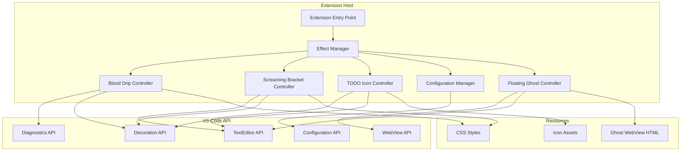
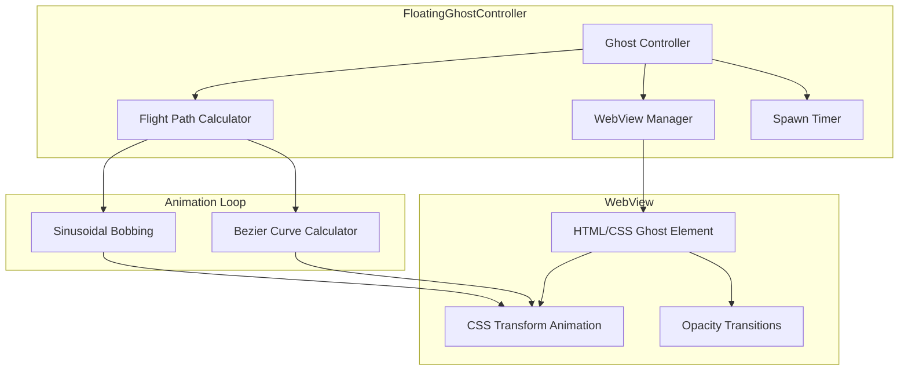

# Blood Drip VS Code Extension - Design Document

## Overview

Blood Drip is a VS Code extension that adds horror-themed visual effects to enhance the coding experience. The extension leverages VS Code's Decoration API and WebView capabilities to render animated blood drips from error lines, screaming brackets on syntax errors, and spooky TODO icons. The architecture prioritizes performance through efficient resource management and animation throttling.

## Architecture



## Components and Interfaces

### 1. Extension Entry Point (`extension.ts`)

The main activation point that initializes all controllers and manages the extension lifecycle.

```typescript
interface ExtensionContext {
  subscriptions: Disposable[];
  extensionPath: string;
}

// Activation function
export function activate(context: ExtensionContext): void;
export function deactivate(): void;
```

### 2. Effect Manager (`effectManager.ts`)

Central coordinator that manages all visual effect controllers and handles global state.

```typescript
interface IEffectManager {
  initialize(context: ExtensionContext): void;
  enableEffect(effectType: EffectType): void;
  disableEffect(effectType: EffectType): void;
  pauseAllEffects(): void;
  resumeAllEffects(): void;
  dispose(): void;
}

enum EffectType {
  BloodDrip = "bloodDrip",
  ScreamingBracket = "screamingBracket",
  TodoIcon = "todoIcon",
  FloatingGhost = "floatingGhost",
}
```

### 3. Blood Drip Controller (`bloodDripController.js`)

Manages blood drip animations on error lines using pooled decorations and single animation intervals per line.

```typescript
interface IBloodDripController {
  initialize(context: ExtensionContext): void;
  onDiagnosticsChange(diagnostics: Diagnostic[]): void;
  updateDecorations(editor: TextEditor): void;
  dispose(): void;
}

interface BloodDripDecoration {
  line: number;
  decorationType: TextEditorDecorationType;
  animationFrame: number;
}

// Pooled decoration types (created once, reused)
interface DecorationPool {
  errorLine: TextEditorDecorationType; // Base error styling
  warningLine: TextEditorDecorationType; // Warning styling
  dripFrames: TextEditorDecorationType[]; // Animation frames (pre-created)
}

// Animation state per line (prevents overlapping intervals)
interface LineAnimationState {
  intervalId: NodeJS.Timeout;
  currentFrame: number;
}
```

#### Fixed Animation Approach

```javascript
// Pre-create all decoration types at initialization (pooled)
const DRIP_EMOJIS = ["🩸", "💧", "🔴"];

class BloodDripController {
  constructor() {
    this.decorationPool = null;
    this.lineAnimations = new Map(); // line -> LineAnimationState
  }

  createDecorationPool() {
    // Create once, reuse forever
    this.decorationPool = {
      errorLine: vscode.window.createTextEditorDecorationType({
        isWholeLine: true,
        backgroundColor: "rgba(139, 0, 0, 0.15)",
        borderWidth: "0 0 0 4px",
        borderStyle: "solid",
        borderColor: "rgba(139, 0, 0, 0.7)",
      }),
      dripFrames: DRIP_EMOJIS.map((emoji) =>
        vscode.window.createTextEditorDecorationType({
          after: { contentText: ` ${emoji}`, color: "#8B0000" },
        })
      ),
    };
  }

  animateLine(editor, line, range) {
    // Stop existing animation on this line (single interval per line)
    if (this.lineAnimations.has(line)) {
      clearInterval(this.lineAnimations.get(line).intervalId);
    }

    let frameIndex = 0;
    const intervalId = setInterval(() => {
      // Clear previous frame, apply next frame from pool
      this.decorationPool.dripFrames.forEach((type, i) => {
        editor.setDecorations(type, i === frameIndex ? [range] : []);
      });
      frameIndex = (frameIndex + 1) % this.decorationPool.dripFrames.length;
    }, 200);

    this.lineAnimations.set(line, { intervalId, currentFrame: 0 });
  }
}
```

### 4. Screaming Bracket Controller (`screamingBracketController.js`)

Detects bracket-related syntax errors and applies pulsing glow effects with scream emojis.

```typescript
interface IScreamingBracketController {
  initialize(context: ExtensionContext): void;
  onDiagnosticsChange(diagnostics: Diagnostic[]): void;
  findBracketErrors(diagnostics: Diagnostic[]): BracketError[];
  applyScreamEffect(editor: TextEditor, errors: BracketError[]): void;
  dispose(): void;
}

interface BracketError {
  position: Position;
  bracketType: BracketType;
  matchingPosition: Position | null;
  errorMessage: string;
}

enum BracketType {
  Parenthesis = "()",
  CurlyBrace = "{}",
  SquareBracket = "[]",
}

// Decoration pool for reuse (prevents rapid create/dispose)
interface DecorationPool {
  screamingBracket: TextEditorDecorationType;
  matchingBracket: TextEditorDecorationType;
  pulseFrames: TextEditorDecorationType[];
}
```

#### Bracket Error Detection

```javascript
const BRACKET_ERROR_PATTERNS = [
  /expected.*[\(\)\{\}\[\]]/i,
  /unmatched.*[\(\)\{\}\[\]]/i,
  /missing.*[\(\)\{\}\[\]]/i,
  /unclosed.*[\(\)\{\}\[\]]/i,
  /unexpected.*[\(\)\{\}\[\]]/i,
];

function isBracketError(diagnostic) {
  return BRACKET_ERROR_PATTERNS.some((pattern) =>
    pattern.test(diagnostic.message)
  );
}
```

#### Pulsing Glow Animation

```javascript
// Pre-create decoration types for animation frames (pooled approach)
const PULSE_FRAMES = [
  {
    backgroundColor: "rgba(255, 0, 0, 0.1)",
    border: "1px solid rgba(255, 0, 0, 0.3)",
  },
  {
    backgroundColor: "rgba(255, 0, 0, 0.2)",
    border: "1px solid rgba(255, 0, 0, 0.5)",
  },
  {
    backgroundColor: "rgba(255, 0, 0, 0.3)",
    border: "1px solid rgba(255, 0, 0, 0.7)",
  },
  {
    backgroundColor: "rgba(255, 0, 0, 0.2)",
    border: "1px solid rgba(255, 0, 0, 0.5)",
  },
];

// Single animation interval per bracket (not overlapping)
class BracketAnimator {
  constructor() {
    this.activeAnimations = new Map(); // line -> intervalId
  }

  startAnimation(line, editor, range) {
    // Stop existing animation on this line first
    if (this.activeAnimations.has(line)) {
      clearInterval(this.activeAnimations.get(line));
    }

    let frameIndex = 0;
    const intervalId = setInterval(() => {
      // Apply pooled decoration frame
      frameIndex = (frameIndex + 1) % PULSE_FRAMES.length;
    }, 100);

    this.activeAnimations.set(line, intervalId);
  }
}
```

### 5. TODO Icon Controller (`todoIconController.ts`)

Scans documents for TODO comments and applies spooky gutter icons.

```typescript
interface ITodoIconController {
  initialize(context: ExtensionContext): void;
  scanDocument(document: TextDocument): void;
  updateDecorations(editor: TextEditor): void;
  setIconVariant(variant: TodoIconVariant): void;
  dispose(): void;
}

enum TodoIconVariant {
  Skull = "skull",
  Ghost = "ghost",
  Tombstone = "tombstone",
}

interface TodoDecoration {
  line: number;
  range: Range;
  iconVariant: TodoIconVariant;
}
```

### 6. Configuration Manager (`configurationManager.ts`)

Handles extension settings and notifies controllers of configuration changes.

```typescript
interface IConfigurationManager {
  initialize(): void;
  getConfig<T>(key: string): T;
  onConfigChange(callback: (config: BloodDripConfig) => void): Disposable;
}

interface BloodDripConfig {
  bloodDripEnabled: boolean;
  screamingBracketEnabled: boolean;
  todoIconEnabled: boolean;
  todoIconVariant: TodoIconVariant;
  floatingGhostEnabled: boolean;
  candlelightEnabled: boolean;
}
```

### 7. Floating Ghost Controller (`floatingGhostController.js`)

Manages the animated floating ghost that flies across the editor using a WebView overlay for smooth, unconstrained animation.

```typescript
interface IFloatingGhostController {
  initialize(context: ExtensionContext): void;
  enable(): void;
  disable(): void;
  toggle(): boolean;
  pause(): void;
  resume(): void;
  dispose(): void;
}

interface GhostConfig {
  minSpawnInterval: number; // 5000ms default
  maxSpawnInterval: number; // 15000ms default
  flightDuration: number; // 2000-5000ms
  fadeInDuration: number; // 300ms
  fadeOutDuration: number; // 500ms
  minOpacity: number; // 0.5
  maxOpacity: number; // 0.9
}

interface FlightPath {
  startPoint: Point; // Spawn point on edge
  endPoint: Point; // Despawn point on opposite/adjacent edge
  controlPoints: Point[]; // Bezier curve control points
  duration: number; // Flight duration in ms
}

interface Point {
  x: number;
  y: number;
}

enum EdgeType {
  Top = "top",
  Bottom = "bottom",
  Left = "left",
  Right = "right",
}
```

#### WebView Overlay Architecture

The floating ghost uses a transparent WebView panel overlaid on the editor:



#### Flight Path Calculation

```javascript
/**
 * Calculate a bezier curve flight path from spawn to despawn point
 * @param {Point} start - Starting point on edge
 * @param {Point} end - Ending point on opposite/adjacent edge
 * @param {number} editorWidth - Width of visible editor
 * @param {number} editorHeight - Height of visible editor
 * @returns {FlightPath}
 */
function calculateFlightPath(start, end, editorWidth, editorHeight) {
  // Generate control points for natural curve
  const midX = (start.x + end.x) / 2;
  const midY = (start.y + end.y) / 2;

  // Add randomness to control points for varied paths
  const controlPoint1 = {
    x: midX + (Math.random() - 0.5) * editorWidth * 0.3,
    y: midY + (Math.random() - 0.5) * editorHeight * 0.3,
  };

  return {
    startPoint: start,
    endPoint: end,
    controlPoints: [controlPoint1],
    duration: 2000 + Math.random() * 3000, // 2-5 seconds
  };
}

/**
 * Calculate position along bezier curve at time t (0-1)
 * @param {FlightPath} path
 * @param {number} t - Progress along path (0-1)
 * @returns {Point}
 */
function getPositionAtTime(path, t) {
  const { startPoint, endPoint, controlPoints } = path;
  const cp = controlPoints[0];

  // Quadratic bezier formula
  const x =
    Math.pow(1 - t, 2) * startPoint.x +
    2 * (1 - t) * t * cp.x +
    Math.pow(t, 2) * endPoint.x;
  const y =
    Math.pow(1 - t, 2) * startPoint.y +
    2 * (1 - t) * t * cp.y +
    Math.pow(t, 2) * endPoint.y;

  // Add sinusoidal bobbing effect
  const bobAmount = 10; // pixels
  const bobFrequency = 3; // oscillations during flight
  const bob = Math.sin(t * Math.PI * 2 * bobFrequency) * bobAmount;

  return { x, y: y + bob };
}
```

#### WebView HTML Template

```html
<!DOCTYPE html>
<html>
  <head>
    <style>
      body {
        margin: 0;
        padding: 0;
        overflow: hidden;
        background: transparent;
        pointer-events: none;
      }
      .ghost {
        position: absolute;
        font-size: 48px;
        opacity: 0;
        filter: drop-shadow(0 0 10px rgba(255, 255, 255, 0.8));
        transition: opacity 0.3s ease-in-out;
        will-change: transform, opacity;
      }
      .ghost.visible {
        opacity: 0.8;
      }
      .ghost.fading {
        opacity: 0;
        transition: opacity 0.5s ease-in-out;
      }
    </style>
  </head>
  <body>
    <div class="ghost" id="ghost">👻</div>
    <script>
      const ghost = document.getElementById("ghost");

      window.addEventListener("message", (event) => {
        const { type, x, y, emoji, phase } = event.data;

        if (type === "move") {
          ghost.style.transform = `translate(${x}px, ${y}px)`;
        } else if (type === "spawn") {
          ghost.textContent = emoji;
          ghost.classList.remove("fading");
          ghost.classList.add("visible");
        } else if (type === "despawn") {
          ghost.classList.remove("visible");
          ghost.classList.add("fading");
        }
      });
    </script>
  </body>
</html>
```

## Data Models

### Decoration Style Definitions

```typescript
// Blood drip decoration style
const bloodDripStyle: DecorationRenderOptions = {
  after: {
    contentText: "",
    textDecoration: "none",
    color: "transparent",
    backgroundColor: "transparent",
  },
  isWholeLine: true,
  overviewRulerColor: "#8B0000",
  overviewRulerLane: OverviewRulerLane.Right,
};

// Screaming bracket decoration style
const screamingBracketStyle: DecorationRenderOptions = {
  backgroundColor: "rgba(255, 0, 0, 0.2)",
  border: "1px solid rgba(255, 0, 0, 0.5)",
  after: {
    contentText: " 😱",
    color: "#FF0000",
  },
};

// TODO icon gutter decoration
const todoIconStyle: DecorationRenderOptions = {
  gutterIconPath: Uri.file("path/to/icon.svg"),
  gutterIconSize: "16px",
};
```

### Animation Frame Data

```typescript
interface AnimationState {
  isRunning: boolean;
  frameCount: number;
  lastFrameTime: number;
  targetFPS: number;
}

interface DripAnimation {
  startLine: number;
  currentOffset: number;
  maxOffset: number;
  color: string;
  opacity: number;
}
```

## Error Handling

| Error Scenario                    | Handling Strategy                        | User Feedback      |
| --------------------------------- | ---------------------------------------- | ------------------ |
| Diagnostics API unavailable       | Gracefully disable blood drip feature    | Status bar message |
| Icon assets not found             | Fall back to default VS Code icons       | Console warning    |
| Animation performance degradation | Reduce frame rate automatically          | None (silent)      |
| Configuration read failure        | Use default configuration values         | Console warning    |
| Memory limit exceeded             | Pause animations, clear decoration cache | Status bar warning |
| Extension activation failure      | Log error, show error notification       | Error notification |

### Error Handling Implementation

```typescript
class ErrorHandler {
  static handleError(error: Error, context: string): void {
    console.error(`[Blood Drip] ${context}:`, error);

    if (error instanceof ResourceError) {
      this.handleResourceError(error);
    } else if (error instanceof PerformanceError) {
      this.handlePerformanceError(error);
    }
  }

  private static handleResourceError(error: ResourceError): void {
    vscode.window.showWarningMessage(
      `Blood Drip: Resource issue - ${error.message}`
    );
  }

  private static handlePerformanceError(error: PerformanceError): void {
    // Silently reduce animation quality
    EffectManager.getInstance().reduceAnimationQuality();
  }
}
```

## Correctness Properties

_A property is a characteristic or behavior that should hold true across all valid executions of a system-essentially, a formal statement about what the system should do. Properties serve as the bridge between human-readable specifications and machine-verifiable correctness guarantees._

### Property 1: Spawn Interval Range

_For any_ spawn interval generated by the ghost controller, the interval SHALL be between 5000ms and 15000ms (inclusive).
**Validates: Requirements 6.7**

### Property 2: Flight Path Edge Crossing

_For any_ spawn point on an editor edge, the calculated flight path SHALL have a despawn point on a different edge (opposite or adjacent), and the path SHALL cross through the visible editor area.
**Validates: Requirements 6.8**

### Property 3: Bezier Position Continuity

_For any_ flight path and any two adjacent time values t1 and t2 where |t2-t1| < 0.1, the calculated positions SHALL differ by no more than 15% of the total path length, ensuring smooth continuous motion.
**Validates: Requirements 6.1, 6.2**

### Property 4: Opacity Range Constraint

_For any_ ghost opacity value during visible state, the opacity SHALL be between 0.5 and 0.9 (inclusive).
**Validates: Requirements 6.5**

### Property 5: CSS Transform Usage

_For any_ animation style generated for ghost movement, the CSS SHALL use transform properties (translate, scale, rotate) and SHALL NOT use layout-triggering properties (top, left, width, height).
**Validates: Requirements 6.10**

### Property 6: Bobbing Effect Bounded

_For any_ position calculated along the flight path, the sinusoidal bobbing offset SHALL be bounded within +/- 15 pixels of the base bezier curve position.
**Validates: Requirements 6.2**

### Property 7: Bracket Error Detection

_For any_ diagnostic message containing bracket-related keywords (expected, unmatched, missing, unclosed, unexpected + bracket characters), the screaming bracket controller SHALL identify it as a bracket error.
**Validates: Requirements 2.1**

### Property 8: Single Animation Interval Per Line

_For any_ error line with an active animation, there SHALL be exactly one animation interval running. Starting a new animation on the same line SHALL first clear the existing interval.
**Validates: Requirements 1.6**

### Property 9: Decoration Pool Reuse

_For any_ blood drip animation cycle, the decoration types used SHALL come from the pre-created pool. No new decoration types SHALL be created during animation.
**Validates: Requirements 1.4**

### Property 10: Matching Bracket Opacity

_For any_ screaming bracket with a matching bracket found, the matching bracket's glow opacity SHALL be less than the screaming bracket's opacity (dimmer glow).
**Validates: Requirements 2.5**

## Testing Strategy

### Unit Tests

| Component                  | Test Focus                                        | Tools                    |
| -------------------------- | ------------------------------------------------- | ------------------------ |
| BloodDripController        | Decoration pooling, single interval per line      | Jest, VS Code Test Utils |
| ScreamingBracketController | Bracket error detection, pulsing animation        | Jest                     |
| TodoIconController         | TODO pattern matching, icon assignment            | Jest                     |
| ConfigurationManager       | Config reading, change notifications              | Jest                     |
| FloatingGhostController    | Flight path calculation, spawn intervals, WebView | Jest                     |

### Property-Based Tests

Property-based testing will be implemented using **fast-check** library to verify correctness properties hold across all valid inputs.

| Property    | Test Description               | Generator Strategy                                          |
| ----------- | ------------------------------ | ----------------------------------------------------------- |
| Property 1  | Spawn interval always in range | Generate random spawn events, verify interval bounds        |
| Property 2  | Flight path crosses editor     | Generate random edge spawn points, verify path geometry     |
| Property 3  | Bezier continuity              | Generate random paths and time pairs, verify position delta |
| Property 4  | Opacity in range               | Generate random ghost states, verify opacity bounds         |
| Property 5  | CSS uses transforms            | Generate animation styles, verify no layout properties      |
| Property 6  | Bobbing bounded                | Generate random path positions, verify bob offset bounds    |
| Property 7  | Bracket error detection        | Generate diagnostic messages, verify bracket detection      |
| Property 8  | Single animation per line      | Generate animation starts, verify interval uniqueness       |
| Property 9  | Decoration pool reuse          | Generate animation cycles, verify no new types created      |
| Property 10 | Matching bracket dimmer        | Generate bracket pairs, verify opacity relationship         |

### Integration Tests

| Test Scenario         | Description                                           |
| --------------------- | ----------------------------------------------------- |
| Extension Activation  | Verify all controllers initialize correctly           |
| Diagnostic Response   | Confirm blood drips appear on error lines             |
| Bracket Errors        | Validate screaming brackets on syntax errors          |
| TODO Detection        | Ensure icons appear for various TODO formats          |
| Configuration Changes | Test real-time setting updates                        |
| Ghost Flight          | Verify ghost spawns, animates, and despawns correctly |

### Test File Structure

```
src/
├── test/
│   ├── suite/
│   │   ├── bloodDripController.test.js
│   │   ├── screamingBracketController.test.js
│   │   ├── todoIconController.test.js
│   │   ├── configurationManager.test.js
│   │   └── floatingGhostController.test.js
│   ├── property/
│   │   ├── floatingGhost.property.test.js
│   │   ├── bloodDrip.property.test.js
│   │   └── screamingBracket.property.test.js
│   ├── integration/
│   │   └── extension.test.js
│   └── runTest.js
```

### Performance Testing

- Memory profiling during extended use
- Frame rate monitoring during animations
- CPU usage measurement with multiple error lines
- Stress testing with large files (10,000+ lines)
- Ghost animation frame rate verification (30+ FPS)

## File Structure

```
blood-drip-vscode/
├── src/
│   ├── extension.js
│   ├── effectManager.js
│   ├── controllers/
│   │   ├── bloodDripController.js
│   │   ├── screamingBracketController.js
│   │   ├── todoIconController.js
│   │   ├── candlelightController.js
│   │   └── floatingGhostController.js
│   ├── services/
│   │   └── configurationManager.js
│   ├── models/
│   │   ├── types.js
│   │   └── decorationStyles.js
│   └── utils/
│       ├── animationUtils.js
│       ├── flightPath.js
│       └── errorHandler.js
├── resources/
│   ├── icons/
│   │   ├── skull.svg
│   │   ├── ghost.svg
│   │   └── tombstone.svg
│   └── ghost-webview.html
├── package.json
└── README.md
```

## VS Code API Usage

| Feature              | API                                                                 | Purpose                           |
| -------------------- | ------------------------------------------------------------------- | --------------------------------- |
| Blood Drip Animation | `TextEditorDecorationType`, `window.createTextEditorDecorationType` | Create animated line decorations  |
| Screaming Brackets   | `languages.onDidChangeDiagnostics`, `TextEditorDecorationType`      | Detect bracket errors, apply glow |
| TODO Icons           | `DecorationRenderOptions.gutterIconPath`                            | Display gutter icons              |
| Error Detection      | `languages.onDidChangeDiagnostics`                                  | Monitor diagnostic changes        |
| Floating Ghost       | `WebviewPanel`, `postMessage`                                       | Render animated ghost overlay     |
| Configuration        | `workspace.getConfiguration`                                        | Read/watch settings               |
| Resource Management  | `Disposable`                                                        | Clean up resources                |

## Animation Implementation

### Blood Drip CSS Animation

The blood drip effect uses CSS keyframe animations injected via decoration styles:

```css
@keyframes bloodDrip {
  0% {
    background: linear-gradient(180deg, #8b0000 0%, transparent 0%);
  }
  100% {
    background: linear-gradient(
      180deg,
      #8b0000 0%,
      #ff0000 50%,
      transparent 100%
    );
    background-size: 100% 200%;
    background-position: 0 100%;
  }
}
```

### Screaming Bracket Pulse Algorithm

```javascript
// Pulse opacity cycles between 0.1 and 0.3 for glow effect
function calculatePulseOpacity(frameIndex, totalFrames = 4) {
  const progress = frameIndex / totalFrames;
  // Sinusoidal pulse: 0.1 -> 0.3 -> 0.1
  return 0.1 + 0.2 * Math.sin(progress * Math.PI);
}
```

## Performance Optimizations

1. **Decoration Pooling**: Reuse decoration types instead of creating new ones
2. **Debounced Updates**: 100ms debounce on diagnostic changes
3. **Animation Throttling**: Cap at 30 FPS, reduce when editor loses focus
4. **Lazy Initialization**: Only initialize controllers when features are enabled
5. **Efficient Pattern Matching**: Use compiled regex for TODO detection
6. **Memory Limits**: Clear old decorations proactively, limit active animations
