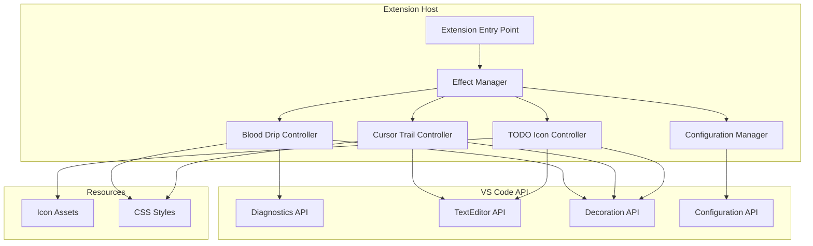

# Blood Drip VS Code Extension - Design Document

## Overview

Blood Drip is a VS Code extension that adds horror-themed visual effects to enhance the coding experience. The extension leverages VS Code's Decoration API and WebView capabilities to render animated blood drips from error lines, ethereal cursor trails, and spooky TODO icons. The architecture prioritizes performance through efficient resource management and animation throttling.

## Architecture



## Components and Interfaces

### 1. Extension Entry Point (`extension.ts`)

The main activation point that initializes all controllers and manages the extension lifecycle.

```typescript
interface ExtensionContext {
    subscriptions: Disposable[];
    extensionPath: string;
}

// Activation function
export function activate(context: ExtensionContext): void;
export function deactivate(): void;
```

### 2. Effect Manager (`effectManager.ts`)

Central coordinator that manages all visual effect controllers and handles global state.

```typescript
interface IEffectManager {
    initialize(context: ExtensionContext): void;
    enableEffect(effectType: EffectType): void;
    disableEffect(effectType: EffectType): void;
    pauseAllEffects(): void;
    resumeAllEffects(): void;
    dispose(): void;
}

enum EffectType {
    BloodDrip = 'bloodDrip',
    CursorTrail = 'cursorTrail',
    TodoIcon = 'todoIcon'
}
```

### 3. Blood Drip Controller (`bloodDripController.ts`)

Manages blood drip animations on error lines using CSS animations and decorations.

```typescript
interface IBloodDripController {
    initialize(context: ExtensionContext): void;
    onDiagnosticsChange(diagnostics: Diagnostic[]): void;
    updateDecorations(editor: TextEditor): void;
    dispose(): void;
}

interface BloodDripDecoration {
    line: number;
    decorationType: TextEditorDecorationType;
    animationFrame: number;
}
```

### 4. Cursor Trail Controller (`cursorTrailController.ts`)

Tracks cursor movement and renders ethereal trail effects.

```typescript
interface ICursorTrailController {
    initialize(context: ExtensionContext): void;
    onCursorMove(position: Position): void;
    updateTrails(): void;
    dispose(): void;
}

interface TrailSegment {
    position: Position;
    opacity: number;
    timestamp: number;
    decorationType: TextEditorDecorationType;
}
```

### 5. TODO Icon Controller (`todoIconController.ts`)

Scans documents for TODO comments and applies spooky gutter icons.

```typescript
interface ITodoIconController {
    initialize(context: ExtensionContext): void;
    scanDocument(document: TextDocument): void;
    updateDecorations(editor: TextEditor): void;
    setIconVariant(variant: TodoIconVariant): void;
    dispose(): void;
}

enum TodoIconVariant {
    Skull = 'skull',
    Ghost = 'ghost',
    Tombstone = 'tombstone'
}

interface TodoDecoration {
    line: number;
    range: Range;
    iconVariant: TodoIconVariant;
}
```

### 6. Configuration Manager (`configurationManager.ts`)

Handles extension settings and notifies controllers of configuration changes.

```typescript
interface IConfigurationManager {
    initialize(): void;
    getConfig<T>(key: string): T;
    onConfigChange(callback: (config: BloodDripConfig) => void): Disposable;
}

interface BloodDripConfig {
    bloodDripEnabled: boolean;
    cursorTrailEnabled: boolean;
    todoIconEnabled: boolean;
    todoIconVariant: TodoIconVariant;
    animationSpeed: number;
    trailLength: number;
}
```

## Data Models

### Decoration Style Definitions

```typescript
// Blood drip decoration style
const bloodDripStyle: DecorationRenderOptions = {
    after: {
        contentText: '',
        textDecoration: 'none',
        color: 'transparent',
        backgroundColor: 'transparent'
    },
    isWholeLine: true,
    overviewRulerColor: '#8B0000',
    overviewRulerLane: OverviewRulerLane.Right
};

// Cursor trail decoration style
const cursorTrailStyle: DecorationRenderOptions = {
    backgroundColor: 'rgba(232, 232, 232, 0.3)',
    borderRadius: '2px'
};

// TODO icon gutter decoration
const todoIconStyle: DecorationRenderOptions = {
    gutterIconPath: Uri.file('path/to/icon.svg'),
    gutterIconSize: '16px'
};
```

### Animation Frame Data

```typescript
interface AnimationState {
    isRunning: boolean;
    frameCount: number;
    lastFrameTime: number;
    targetFPS: number;
}

interface DripAnimation {
    startLine: number;
    currentOffset: number;
    maxOffset: number;
    color: string;
    opacity: number;
}
```

## Error Handling

| Error Scenario | Handling Strategy | User Feedback |
|----------------|-------------------|---------------|
| Diagnostics API unavailable | Gracefully disable blood drip feature | Status bar message |
| Icon assets not found | Fall back to default VS Code icons | Console warning |
| Animation performance degradation | Reduce frame rate automatically | None (silent) |
| Configuration read failure | Use default configuration values | Console warning |
| Memory limit exceeded | Pause animations, clear decoration cache | Status bar warning |
| Extension activation failure | Log error, show error notification | Error notification |

### Error Handling Implementation

```typescript
class ErrorHandler {
    static handleError(error: Error, context: string): void {
        console.error(`[Blood Drip] ${context}:`, error);
        
        if (error instanceof ResourceError) {
            this.handleResourceError(error);
        } else if (error instanceof PerformanceError) {
            this.handlePerformanceError(error);
        }
    }
    
    private static handleResourceError(error: ResourceError): void {
        vscode.window.showWarningMessage(
            `Blood Drip: Resource issue - ${error.message}`
        );
    }
    
    private static handlePerformanceError(error: PerformanceError): void {
        // Silently reduce animation quality
        EffectManager.getInstance().reduceAnimationQuality();
    }
}
```

## Testing Strategy

### Unit Tests

| Component | Test Focus | Tools |
|-----------|------------|-------|
| BloodDripController | Decoration creation, diagnostic handling | Jest, VS Code Test Utils |
| CursorTrailController | Trail segment management, opacity calculations | Jest |
| TodoIconController | TODO pattern matching, icon assignment | Jest |
| ConfigurationManager | Config reading, change notifications | Jest |

### Integration Tests

| Test Scenario | Description |
|---------------|-------------|
| Extension Activation | Verify all controllers initialize correctly |
| Diagnostic Response | Confirm blood drips appear on error lines |
| Cursor Movement | Validate trail rendering on cursor position changes |
| TODO Detection | Ensure icons appear for various TODO formats |
| Configuration Changes | Test real-time setting updates |

### Test File Structure

```
src/
├── test/
│   ├── suite/
│   │   ├── bloodDripController.test.ts
│   │   ├── cursorTrailController.test.ts
│   │   ├── todoIconController.test.ts
│   │   └── configurationManager.test.ts
│   ├── integration/
│   │   └── extension.test.ts
│   └── runTest.ts
```

### Performance Testing

- Memory profiling during extended use
- Frame rate monitoring during animations
- CPU usage measurement with multiple error lines
- Stress testing with large files (10,000+ lines)

## File Structure

```
blood-drip-vscode/
├── src/
│   ├── extension.ts
│   ├── effectManager.ts
│   ├── controllers/
│   │   ├── bloodDripController.ts
│   │   ├── cursorTrailController.ts
│   │   └── todoIconController.ts
│   ├── services/
│   │   └── configurationManager.ts
│   ├── models/
│   │   ├── types.ts
│   │   └── decorationStyles.ts
│   └── utils/
│       ├── animationUtils.ts
│       └── errorHandler.ts
├── resources/
│   ├── icons/
│   │   ├── skull.svg
│   │   ├── ghost.svg
│   │   └── tombstone.svg
│   └── styles/
│       └── bloodDrip.css
├── package.json
├── tsconfig.json
└── README.md
```

## VS Code API Usage

| Feature | API | Purpose |
|---------|-----|---------|
| Blood Drip Animation | `TextEditorDecorationType`, `window.createTextEditorDecorationType` | Create animated line decorations |
| Cursor Trail | `window.onDidChangeTextEditorSelection` | Track cursor movement |
| TODO Icons | `DecorationRenderOptions.gutterIconPath` | Display gutter icons |
| Error Detection | `languages.onDidChangeDiagnostics` | Monitor diagnostic changes |
| Configuration | `workspace.getConfiguration` | Read/watch settings |
| Resource Management | `Disposable` | Clean up resources |

## Animation Implementation

### Blood Drip CSS Animation

The blood drip effect uses CSS keyframe animations injected via decoration styles:

```css
@keyframes bloodDrip {
    0% { 
        background: linear-gradient(180deg, #8B0000 0%, transparent 0%);
    }
    100% { 
        background: linear-gradient(180deg, #8B0000 0%, #FF0000 50%, transparent 100%);
        background-size: 100% 200%;
        background-position: 0 100%;
    }
}
```

### Cursor Trail Fade Algorithm

```typescript
function calculateTrailOpacity(segment: TrailSegment): number {
    const age = Date.now() - segment.timestamp;
    const fadeProgress = age / TRAIL_FADE_DURATION; // 800ms
    return Math.max(0, 0.5 - (fadeProgress * 0.4)); // 0.5 to 0.1
}
```

## Performance Optimizations

1. **Decoration Pooling**: Reuse decoration types instead of creating new ones
2. **Debounced Updates**: 100ms debounce on diagnostic changes
3. **Animation Throttling**: Cap at 30 FPS, reduce when editor loses focus
4. **Lazy Initialization**: Only initialize controllers when features are enabled
5. **Efficient Pattern Matching**: Use compiled regex for TODO detection
6. **Memory Limits**: Cap trail segments at 10, clear old decorations proactively
